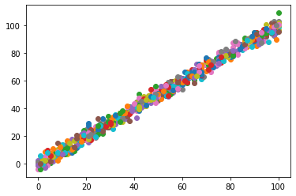

# Question and Instruction (Assignment_on_Regression_Task)
## Data link for building a linear model.

#### Data : 
https://drive.google.com/file/d/1aan_rIOErIVZDX2OKVM41oF61G_XUA2B/view?usp=sharing

NB : I have also downloaded the data in this directory named  `data-linear-reg.csv`
#### instructions:
- write code to find w0 and w1. print them in the screen.
- predict value of y when x is the last 2 digits of your roll number. Print predicted y in the screen.
- upload pdf to submit

# Solution Screenshots :

