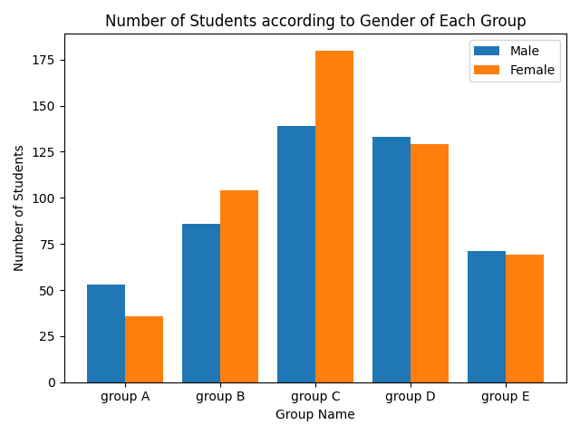
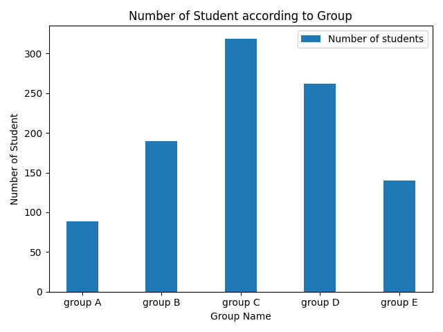
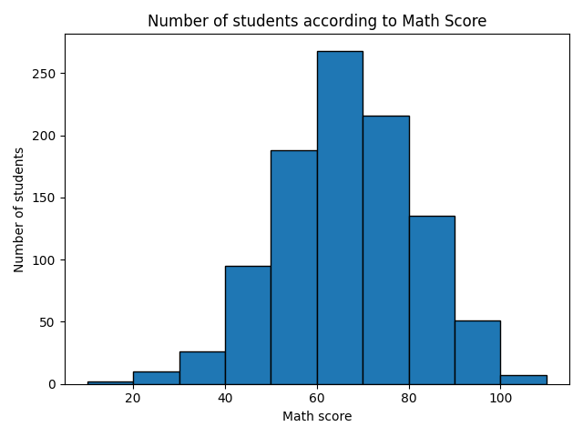
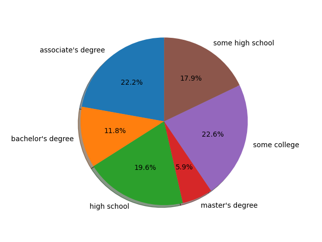

# Question and Instruction (EDA_and_Visualization)
### Data :
https://drive.google.com/file/d/1xI1XHDWVG607C1E9y80NSEFXLp4bvVM2/view?usp=sharing 

### Tasks : 
1. Task 1: plot a bar chart to explore student `group`. Each bar is a `group` and count of students in y-axis [Example: https://benalexkeen.com/bar-charts-in-matplotlib/ ]
2. Task 2: find mean, median, the mode, and variance for `written score`. Print three values.
3. Task 3: show a histogram of `math score`. [Example: https://mode.com/example-gallery/python_histogram/ ]
4. Task 4: create a pie chart for `parental level of education` percentage. [Example: https://matplotlib.org/stable/gallery/pie_and_polar_charts/pie_features.html ] 

### Recommended Tutorial for matplotlib, and pandas in python :
- use python pandas to read the CSV file into a data frame. 
- google colab can be used to avoid installation of packages/environment  
- https://www.youtube.com/watch?v=vmEHCJofslg
- https://youtu.be/a9UrKTVEeZA?t=359

### Programming language : 
Any programming language is ok including  xls chart. 

### Submission Instruction : 
- Submit a pdf file with code and plot. 
- Set plot title, x and y-axis labels when applicable. 
- Make sure your code/formula is visible in the submission
- Start early

# Solution Screenshots :
#### Solve Task 1 :

#### Solve Task 3 :

#### Solve Task 4 :

 

# Reference :
#### Pandas Tutorial : 
- https://www.youtube.com/playlist?list=PLeo1K3hjS3uuASpe-1LjfG5f14Bnozjwy
- https://www.youtube.com/watch?v=n0krwG38SHI
#### For Task 1 :
- https://www.youtube.com/watch?v=a-im0rYzXJA
- https://machinelearningknowledge.ai/pandas-tutorial-groupby-where-and-filter/
- https://pandas.pydata.org/pandas-docs/stable/reference/api/pandas.core.groupby.DataFrameGroupBy.filter.html
- https://stackoverflow.com/questions/27488080/python-pandas-filter-rows-after-groupby

#### For Task 2 :
- https://www.youtube.com/watch?v=UgYbGxD_n04
- https://www.youtube.com/watch?v=4iWvii96A1c
- https://www.youtube.com/watch?v=LJ2e5VKMZK0
- https://www.youtube.com/watch?v=WSjVx-pRy2E

#### For Task 3 :

#### For Task 4 :

